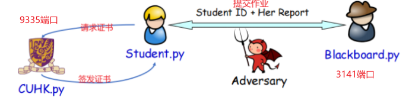
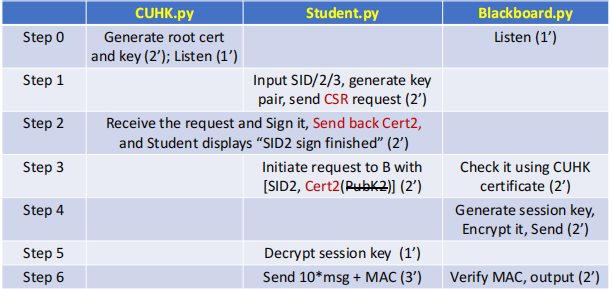
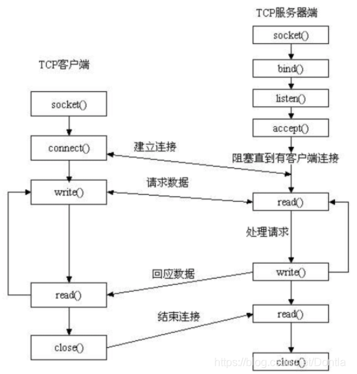

### 场景：学生向Blackboard上提交作业

#### 具体流程

##### CUHK(服务端) Port:9335
> 保持进程监听Student的请求

##### STUDENT（客户端）
> 当输入Student ID后，向CUHK(9335)发起请求。

##### BLACKBOARD（服务端） Port:3141
> 保持进程监听

##### SOCKET

##### Note
> 一般流程为: 先生成一个私钥，然后用私钥生成证书请求(证书请求里应含有公钥信息)，再利用证书服务器的CA根证书来签发证书。但是向CA申请证书通常不免费，我们可以通过openssl自签名的形式生成ssl证书，实现https访问效果，.crt结尾的是证书文件，.key结尾的是密钥文件，.csr结尾的是证书请求文件。

##### REFERENCE
- Socket Programming 1: https://blog.csdn.net/a883774913/article/details/125395179
- Socket Programming 2: https://blog.csdn.net/Dontla/article/details/103679153
- OpenSSL Document: https://www.pyopenssl.org/en/latest/
- Generate Self-Sign Certificate: https://blog.csdn.net/TheGreenSummer/article/details/110285923